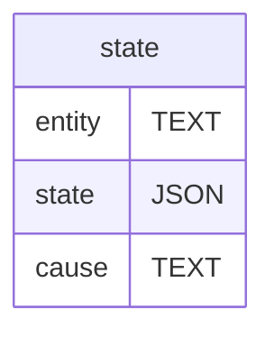

# Common store

> Attempt to capture JSON store described by seefeld

## Overview

This will be a simple JSON store for a catalog of JSON documents. Clients will have a websocket based API to read/write/update documents and watch for changes at **document level granularity**. In nutshell it's similar to filesystem but only supported file types are JSON.

## API

This is a description of the websocket based API.

```ts
/**
 * Command can describe set of operations to be performed. When submitting a
 * more then one operation all operations are performed before response is
 * sent back.
 * 
 * ⚠️ No transactional gurantees, meaning some operations may succeed and some
 * may fail. Response will contain results for each operation under the same
 * keys.
 *
 * ⚠️ Execution order is non-deterministic. If you need order send one command
 * and then send another.
 */
interface Command {
 pull?: Record<string, Push>
 push?: Record<string, Pull>
 watch?: Record<string, DocumentAddress>
 unwatch?: Record<string, DocumentAddress>
}


/**
 * Document repositonry identifier. It is RECOMMENDED to
 * use `did:key` identifiers or some other format for
 * representing public keys.
 */
type RepositoryID = string

/**
 * Document identifier. It is RECOMMENDED to
 * use unique identifiers either derived
 * like merkle reference or random like UUID.
 */
type DocumentID = string


/**
 * Sets document (`entity`) state to a given value (`state`) in the repository (`target`)
 * if `cause` invariant is true.
 */
interface Push {
  /**
   * Repository being updated.
   */
  replica: RepositoryID

  /**
   * Document being updated
   */
  entity: DocumentID

  /**
   * State document being updated to
   */
  state: JSON
    
  /**
   * State invariant, that needs to be true for push to
   * succeed. Omitting implies new document creation.
   */
  cause?: Checksum
}


/**
 * Document checksum. Store implementation can choose whatever
 * way it wishes to derive canonical checksum for the document.
 */ 
type Checksum = string

/**
 * Operation for pulling document state from the
 * specified repository. If `cause` invariant is
 * set and it corresponds to current document state,
 * result will not contain `state`.
 */
interface Pull {
  replica: RepositoryID
  entity: DocumentID
  cause?: Checksum
}

/**
 * Same as `Pull` but without `cause` invariant, implying
 * that result will always contain `state`
 */
interface Address = {
  replica: RepositoryID
  entity: DocumentID
}

interface Status extends Address {
  cause: Checksum
}

interface State extends Status {
 state: JSON
}


/**
 * Describes response returned for the command.
 */
type Receipt<For extends Command> = {
  pull: { [Key in keyof For['pull']]: Result<State|Status, PullError> }
  push: { [Key in keyof For['push']]: Result<Status, PushError> }
  watch: { [Key in keyof For['watch']]: Result<State, WatchError> }
  unwatch: { [Key in keyof For['unwatch']]: Result<Status, UnwatchError> }
}
```

### Command

Command describes batch of operations client can request service to perform. It is important to call out that batches are not executed with any transactional gurantees, implying that some operations in the command may succeed while others fail. Furthermore, opeartion execution order is non-deterministic, therefor if order of operation matters client MUST take execute them in a separate commands.

> For example if document `A` has some pointer to the content in the document `B`, client would want to update pointer in the `A` document before deleting content `A` pointed in the document `B`. If both operations were send in a single command, race may occur and there may be a time frame in which `A` is pointing to the content in document `B` that does not exist.

#### Operations

Command MAY contain `pull`, `push`, `watch` and `unwatch` operation sets, represented by dictionaries e.g.

```js
const response = client.request({
  pull: {
    profile: {
      replica: "did:key:z6Mkk89bC3JrVqKie71YEcc5M1SMVxuCgNx6zLZ8SYJsxALi"
      entity: "4301a667-5388-4477-ba08-d2e6b51a62a3",
      
    },
    recepies: {
      replica: "did:key:z6Mkk89bC3JrVqKie71YEcc5M1SMVxuCgNx6zLZ8SYJsxALi",
      entity: "4301a667-5388-4477-ba08-d2e6b51a62a3",
      cause: "ba4jcb2tb7gb5llskpwvdfxckvvkmrsl4lfooktkfd4thucfgawd7ghqp"
    }
  },
  push: {
    status: {
      replica: "did:key:z6Mkk89bC3JrVqKie71YEcc5M1SMVxuCgNx6zLZ8SYJsxALi",
      entity: "8c642d0d-9c67-4925-9fe5-405486e7dea7",
      state: { online: Date.now() },
    },
    description: {
      replica: "did:key:z6Mkk89bC3JrVqKie71YEcc5M1SMVxuCgNx6zLZ8SYJsxALi",
      entity: "3c8b0faf-cfb7-4537-a040-78bb48cfb962",
      state: { "description": "Chief Witch" },
      cause: "ba4jcbmzammd3t4cwbpfdxjbo4st4k4azmaozlhtklv6rxkppuxal3ywe"
    }
  },
})
```

Keys in of the operation sets are arbitrary and are used for mapping operation results in the response.

```js
assert.deepEqual(response, {
  ok: {
    pull: {
      profile: {
        ok: {
          replica: "did:key:z6Mkk89bC3JrVqKie71YEcc5M1SMVxuCgNx6zLZ8SYJsxALi",
          entity: "4301a667-5388-4477-ba08-d2e6b51a62a3",
          state: { value: { name: "Alice" } },
          cause: "ba4jcbgvygxoujlhz5a44cfyxtnrb6a6zxby2mdjhbthee7jvkcijdmlg"
        }
      },
      author: {
        error: {
          name: 'Not Found',
          message: 'Document "4301a667-5388-4477-ba08-d2e6b51a62a3" not found in "did:key:z6Mkk89bC3JrVqKie71YEcc5M1SMVxuCgNx6zLZ8SYJsxALi"'
        }
      }
    },
    push: {
      status: {
        ok: {
          replica: "did:key:z6Mkk89bC3JrVqKie71YEcc5M1SMVxuCgNx6zLZ8SYJsxALi",
          entity: "8c642d0d-9c67-4925-9fe5-405486e7dea7",
          cause: "ba4jcb3cxb2lvygdel7ljg4akgvppv6lrblhznsclcruz2m7ya75p4cvn"
        }
      },
      description: {
        error: {
          name: "PushError",
          replica: "did:key:z6Mkk89bC3JrVqKie71YEcc5M1SMVxuCgNx6zLZ8SYJsxALi",
          entity: "3c8b0faf-cfb7-4537-a040-78bb48cfb962",
          state: { value: { online: 1737492200331 } },
          
          expected: "ba4jcbmzammd3t4cwbpfdxjbo4st4k4azmaozlhtklv6rxkppuxal3ywe"
          actual: "ba4jcbpionvcxjrzkl6lkwp5vtaanzwdnh5ydgrnylhd3cmjuemxr2owh",
          message: "Target invariant missmatch, please rebase your changes"
        }
      }
    }
  }
})
```


### Pull

Pulls latest document state from the store. If document state corresponds to specified `cause` checksum result will be `Status` as opposed to `State` leaving out document snapshot (since it has not change).

> ℹ️ To force `state` inclusion simply leave out `cause` field in the `Pull` request.

Attempt to pull document fails if pulled document or the source repository does not exist.


### Push

Swaps document state in the `source` repository with a [Compare and Swap (CAS)][CAS] transactional guarantees, that is operation fails if `cause` field does not correspond to the current document state.

Omiting `cause` field implies new document creation and push will fail if such does already exists. If new document is pushed to non existing `source` repository new repository will be created.

> ⚠️ It is likely that new repository creation will work differently in the future when there is access control in place.


### Watch

Watch operation can be used into subscribe to the document state changes in the `source` repository. Succesful operation will return `State` result for the current document state. `State` updates will also be pushed every time document is updated.

Duration of watch is session bound, meaning that after client disconnects all the watches will be dropped and it's up to client to set them up again.

#### Unwatch

Stops watching a document for changes. Once document is unwatched no future push notifications will be pushed to the client.

## Persistence

JSON documents will be persisted in SQLite. It will be [stored as ordinary text](https://arc.net/l/quote/vsmijstd) and all read/write operations will use [SQLites builtin JSON functionality](https://www.sqlite.org/json1.html).


## Database Schema

Each repository is a sqlite database consisting of a single table with primary key corresponding to `DocumentID` and JSON type `state` column. Additional `cause` column is used to manage atomic updates.





## Document metadata

Metadata SHOULD be stored as part of the document. SQLite will not index JSON documents in any way, so while it will be possible to query documents (by metadata or state) they will not be optimized.

In the future we may choose to replicate some document fields in order to index them, however that introduces document schemas and typing and etc... so we'll need to choose between:

1. Keep evolving schema as requirements change.
2. Use triples for blanket indexing.
3. Only support specific fields _(Which is basically optimistic take on 1st option)_.

[CAS]:https://en.wikipedia.org/wiki/Compare-and-swap
[merkle reference]:https://github.com/Gozala/merkle-reference/blob/main/docs/spec.md