# Identity

## Editors

- [Irakli Gozalishvili], [Common Tools]

## Authors

- [Irakli Gozalishvili], [Common Tools]

## Abstract

The Identity system forms the foundation of the Open Ocean Protocol, establishing self-sovereign identities that enable users to own and control their digital presence. This specification defines how identities are created, verified, and used to establish ownership and control across the protocol ecosystem.

## Language

The key words "MUST", "MUST NOT", "REQUIRED", "SHALL", "SHALL NOT", "SHOULD", "SHOULD NOT", "RECOMMENDED", "MAY", and "OPTIONAL" in this document are to be interpreted as described in [RFC 2119](https://datatracker.ietf.org/doc/html/rfc2119).

## Concepts

### Self-Sovereign Identity

In the Open Ocean Protocol, identities are fully self-sovereign, meaning:

1. **User-controlled** - Identities are created and controlled by users without requiring permission from any central authority
2. **Cryptographically secure** - Identities are based on public key cryptography, allowing verifiable claims of ownership
3. **Portable** - Identities can be used across different applications, services, and devices
4. **Private by default** - Users control what information is associated with their identity and shared with others
5. **Pseudonymous** - Users can maintain separate profiles without revealing their connection to a common account

### Decentralized Identifiers (DIDs)

The protocol uses [DID:Key](https://w3c-ccg.github.io/did-method-key/) as the primary identifier mechanism. Each identity is represented by a [did:key] identifier, which:

1. Is derived directly from a cryptographic public key
2. Can be generated offline without relying on any registry or authority
3. Enables verification of digital signatures associated with the identity
4. Can be resolved to retrieve the corresponding public key

## Implementation

### Identity Creation

The identity creation process follows a hierarchical approach that ensures both security and usability.

#### Account ID

The root of identity in the Open Ocean Protocol is the account ID:

1. Account keys are created using the [Web Authentication API]
2. This leverages platform authenticators (such as biometrics, secure enclaves, or hardware tokens)
3. The resulting public key becomes the root identifier for the user
4. A [did:key] identifier is derived from this public key
5. The private key never leaves the secure element, enhancing security

#### Profile / Session Identifiers

Profile / Session identifiers represent user profiles and provide a practical layer for daily operations:

1. Profile identifiers are derived from the account key using the [WebAuthn PRF extension]
2. This derivation happens within the secure element without exposing the account's private key
3. The same profile identifier can be derived across all user devices by leveraging WebAuthn's account key synchronization
4. Different contexts can use different profile identifiers from the same account key
5. Profile identifiers conceal the account identity, allowing users to create multiple profiles without revealing they belong to the same account
6. Ed25519 is the RECOMMENDED key type for profile identifiers

Profiles are semantically no different from authorization sessions, as they create unique identifiers to access a space or set of spaces without revealing anything about the account behind them. This dual nature allows them to serve both as persistent user identities and as secure, privacy-preserving authorization mechanisms.

#### Space Identifiers

Each memory space has its own dedicated identifier:

1. Space identifiers are deterministically derived from the profile / session identifier and a seed phrase (typically the space petname)
2. This ensures that each space has a unique identity while still being recoverable
3. The derivation process is deterministic, allowing recreation of all space identifiers when needed
4. Ed25519 is the RECOMMENDED key type for space identifiers
5. Space identifiers form the root authority for the space and are untraceable to the account and profile that created them unless desired by the creator

#### Space Access and Delegations

When a user creates a new space:

1. The space identifier (derived from profile / session identifier) serves as the root authority for that space
2. The space owner SHOULD immediately delegate access to their profile identifier using [UCAN]
3. The profile identifier is then used for all operations on the space rather than the space identifier directly
4. This approach makes the space owner indistinguishable from any other member invited to the space
5. Additional delegations can be created to grant access to other profiles or applications
6. The owner can revoke delegations at any time while maintaining control through the space identifier

For enhanced privacy, users can generate unique profiles / sessions per space:

1. Different profile identifiers can be derived for different spaces or groups of spaces
2. This makes it untraceable which profiles have access to which spaces
3. Even when sharing multiple spaces with the same collaborators, unique profiles prevent correlation

### Key Recovery

A key advantage of this hierarchical approach is simplified recovery:

1. Users don't need to manually manage or backup their cryptographic keys
2. Access to all user spaces can be recovered on a new device through WebAuthn authentication
3. Profile / Session identifiers are automatically synchronized across user devices through WebAuthn
4. The deterministic derivation process recreates the exact same space identifiers when provided with the same inputs
5. This enables seamless device migration without requiring complex key management
6. Privacy is maintained throughout the recovery process, preserving the separation between different user profiles

### Profile Keychains

Each profile includes a built-in keychain that serves as a user-managed identity hub:

1. The keychain functionality is implemented using the profile identifier directly
2. The keychain acts as an addressbook that holds mappings between space [petnames](https://en.wikipedia.org/wiki/Petname) and their corresponding DID identifiers
3. It stores UCAN delegations for all spaces that the profile has access to
4. When a user accesses their account from a new device, the keychain enables recovery of access to all spaces they had on other devices
5. Profile keychains provide a convenient way to manage space access without compromising privacy

The use of petnames in profile keychains allows users to assign meaningful, human-readable names to spaces while the system internally uses cryptographic identifiers. This creates a mapping between the user's mental model and the underlying technical implementation.

### Authorization

Identities serve as the root of authority for:

1. **Space ownership** - Each personal data space is owned by exactly one identity (via its space identifier)
2. **Authorization delegation** - The identity owner can delegate specific capabilities to applications, services, and other identities using [UCAN]
3. **Data verification** - All operations within the protocol can be cryptographically verified against the identity's public key
4. **Privacy-preserving collaboration** - Through delegation patterns that conceal the identity of the space owner

### Identity Hierarchy Visualization

The following diagram illustrates the hierarchical relationship between different components of the identity system:

The diagram shows:

- Alice's account derives multiple profile identifiers for different contexts: Work, Family, and Gaming (dashed arrows)
- Bob and Mallory each have their own accounts with their own derived profiles
- Each profile includes a built-in keychain for managing access to spaces
- Profiles create shared spaces for specific purposes (dashed arrows for creation)
- Shared spaces delegate access back to their creating profile (solid arrows for delegation)
- Cross-profile sharing occurs both within Alice's account (Tokyo Trip shared between Work and Family profiles) and across accounts (Family Photos shared with Bob's Family profile, Client Project shared with Mallory's Work profile)
- All components within each account are not linkable without access to the respective account key
- External collaborators cannot determine which profile created a space versus which profiles have delegated access

### Delegation Flow

The following diagram illustrates the delegation flow for space access:

```mermaid
sequenceDiagram
    actor Alice

    participant AliceAccount as 🔐 Account 🙎‍♀️
    participant AliceProfile as 🏠 Family 🙎‍♀️
    participant Space as 📸 Family Photos
    participant BobProfile as 🏠 Bob 👨🏽‍💼
    
    Alice-->>AliceAccount: Authenticate with WebAuthn
    AliceAccount-->>AliceProfile: Derive Family Profile

    participant BobAccount as 🔐 Account 👨🏽‍💼
    actor Bob
    Bob-->>BobAccount: Authenticate with WebAuthn
    BobAccount-->>BobProfile: Derive Family Profile
    AliceProfile-->>Space: Create "Family Photos" Space
    Space->>AliceProfile: Delegate access (UCAN)
    
    Alice-->>BobProfile: Invite Bob (husband)
    Note over AliceProfile,Space: Alice uses Family Profile to access Family Photos
    
    Space->>BobProfile: Delegate access (UCAN)
    Note over Space,BobProfile: Bob cannot tell that Alice is the owner of the Family Photos space
    


```

This sequence shows how Alice can create and share a Family Photos space with Bob while preserving her privacy. The identity system enables this family collaboration while maintaining a clear chain of authority that doesn't reveal Alice's ownership to Bob.

### Credential Issuance

The identity system supports the issuance and verification of credentials:

1. **Self-attested claims** - Users can make verifiable claims about their own identity
2. **Third-party attestations** - External parties can issue credentials attesting to various attributes of an identity
3. **Selective disclosure** - Users can choose which aspects of their identity to reveal in different contexts

## References

[Irakli Gozalishvili]: https://github.com/gozala
[Common Tools]: https://commontool.org
[did:key]: https://w3c-ccg.github.io/did-method-key/
[UCAN]: https://github.com/ucan-wg/spec/
[Web Authentication API]: https://developer.mozilla.org/en-US/docs/Web/API/Web_Authentication_API
[WebAuthn PRF extension]: https://github.com/w3c/webauthn/wiki/Explainer:-PRF-extension
[petname]: https://en.wikipedia.org/wiki/Petname
