# Identity

## Editors

- [Irakli Gozalishvili], [Common Tools]

## Authors

- [Irakli Gozalishvili], [Common Tools]

## Abstract

The Identity system forms the foundation of the Open Ocean Protocol, establishing self-sovereign identities that enable users to own and control their digital presence. This specification defines how identities are created, verified, and used to establish ownership and control across the protocol ecosystem.

## Language

The key words "MUST", "MUST NOT", "REQUIRED", "SHALL", "SHALL NOT", "SHOULD", "SHOULD NOT", "RECOMMENDED", "MAY", and "OPTIONAL" in this document are to be interpreted as described in [RFC 2119](https://datatracker.ietf.org/doc/html/rfc2119).

## Overview and Objectives

The Identity system in Open Ocean Protocol provides a comprehensive framework for managing digital identities with the following key objectives:

1. **Self-sovereign control** - Users maintain complete ownership of their identities
2. **Privacy by design** - Multiple profiles protect user privacy across different contexts
3. **Seamless recovery** - Simple device migration without compromising security
4. **Verifiable authorization** - Cryptographically secure delegation of capabilities
5. **Pseudonymous collaboration** - Interact with others without revealing account linkages

At its core, the system uses [DID:Key](https://w3c-ccg.github.io/did-method-key/) identifiers based on public key cryptography, combined with [WebAuthn] for secure, cross-device authentication and [UCAN] for capability-based authorization.

## Identity Hierarchy

The identity system follows a three-tier hierarchical structure:

### Account Identifiers

Account identifiers represent the root of a user's identity:

1. Generated using the [Web Authentication API]
2. Secured by platform authenticators (biometrics, hardware tokens)
3. Private keys never leave the secure environment
4. Provide the foundation for cross-device synchronization
5. Derive to multiple independent profile identifiers

### Profile Identifiers

Profile identifiers enable context-specific personas:

1. Derived from account key using the [WebAuthn PRF extension]
2. Create separation between different aspects of digital life (work, personal, etc.)
3. Include built-in keychain functionality for managing space access
4. Remain unlinked from each other without access to the account key
5. Ed25519 is the RECOMMENDED key type for profiles

### Space Identifiers

Space identifiers represent the root authority for memory spaces:

1. Deterministically derived from profile identifiers and seed phrases
2. Provide the root authority for memory spaces
3. Delegate access to profile identifiers and other identities
4. Untraceable to creating account and profile when desired
5. Ed25519 is the RECOMMENDED key type for spaces

## Identity Use Cases

### Personal Data Management

Identities enable users to:

1. Create and manage memory spaces for different contexts
2. Associate personal data with specific profiles
3. Recover access to all spaces when using a new device
4. Assign human-readable [petnames] to cryptographic identifiers
5. Maintain separation between different aspects of digital life

### Collaboration and Sharing

The identity system facilitates secure collaboration by:

1. Enabling sharing of spaces between profiles both within and across accounts
2. Concealing the space owner's identity from other collaborators
3. Allowing fine-grained access control through capability delegation
4. Supporting revocation of access when needed
5. Enabling unique, unlinkable identifiers for each collaborative context

### AI Agent Authorization

Identities provide a secure foundation for AI integration:

1. Delegate specific capabilities to AI agents via [UCAN]
2. Scope AI access to specific memory spaces
3. Maintain audit trails of AI actions through cryptographic verification
4. Revoke AI access when no longer needed
5. Create profile-specific AI agents with limited context access

## Access Control and Authorization

### Capability-Based Security

The identity system uses capability-based security through [UCAN]:

1. Space identifiers serve as the root of authority
2. Capabilities define what actions are permitted (assert, retract, query)
3. Delegations form a verifiable chain back to the authorizing identity
4. Delegations are cryptographically signed proofs of authorization
5. All operations require a valid delegation chain

### Privacy-Preserving Delegation Patterns

The system supports multiple delegation patterns:

1. **Direct delegation** - Space directly delegates to a profile
2. **Chain delegation** - Profile delegates access to another profile
3. **Anonymous delegation** - Delegations that deliberately obfuscate the delegator
4. **Time-bound delegation** - Access granted for a specific duration
5. **Capability-restricted delegation** - Limited subset of operations permitted

### Keychain Management

Each profile includes keychain functionality to:

1. Store mappings between space [petnames] and DIDs
2. Manage UCAN delegations to spaces and from other identities
3. Auto-synchronize across devices via WebAuthn
4. Recover access to spaces on new devices
5. Organize spaces by context without revealing connections

## Identity Recovery

The hierarchical identity structure enables robust recovery:

1. Users authenticate on new devices using WebAuthn
2. Profile identifiers are derived using the same inputs
3. Space access is recovered through stored delegations
4. No need for manual backup of cryptographic keys
5. Recovery process preserves privacy boundaries between profiles

## Identity Hierarchy Visualization

The following diagram illustrates the hierarchical relationship between different components of the identity system:

```mermaid
graph TB
    classDef account fill:#4F72FC,stroke:#4F72FC,stroke-width:1px,color:#FFFFFF,rx:10,ry:10
    classDef profile fill:#AE3EC9,stroke:#AE3EC9,stroke-width:1px,color:#FFFFFF,rx:10,ry:10
    classDef space fill:#40C057,stroke:#40C057,stroke-width:1px,color:#FFFFFF,rx:10,ry:10
    classDef external fill:#FF8787,stroke:#E03131,stroke-width:1px,color:#FFFFFF,rx:10,ry:10

    A(("🔐 Alice 👩‍💼")):::account
    P1>"💼 &nbsp;Work 👩‍💼"]:::profile
    P2>"🏠 Family 👩‍💼"]:::profile
    P3>"🎮 Gaming 👩‍💼"]:::profile

    B(("🔐 Bob 👨🏽‍💼")):::account
    BP>"🏠 Family 👨🏽‍💼"]:::profile

    M(("🔐 Mallory 👩🏻‍🔬")):::account
    MP>"🔬 Work 👩🏻‍🔬"]:::profile

    B -.->|derives| BP
    A -.->|derives| P1
    A -.->|derives| P2
    A -.->|derives| P3
    M -.->|derives| MP

    S3["📸 Family Photos"]:::space
    S1["✈️ Tokyo Trip"]:::space
    S2["📊 Client Project"]:::space
    S4["🎲 Gaming Guild"]:::space

    P1 -.->|creates| S1
    P1 -.->|creates| S2
    P2 -.->|creates| S3
    P3 -.->|creates| S4

    S1 -->|delegates to| P1
    S3 -->|delegates to| P2
    S2 -->|delegates to| P1
    S4 -->|delegates to| P3

    S3 -->|shared with| BP
    S1 -->|shared with| P2
    S3 -->|shared with| P1
    S2 -->|shared with| MP
```

This diagram shows:

- Account identifiers derive multiple profiles for different contexts (dashed arrows)
- Each profile creates and manages spaces (dashed arrows for creation)
- Spaces delegate access to profiles (solid arrows for delegation)
- Cross-profile sharing occurs both within and across accounts
- Without the account key, profiles from the same account appear unrelated

## Delegation Flow

The following diagram illustrates how delegation enables private collaboration:

```mermaid
sequenceDiagram
    actor Alice

    participant AliceAccount as 🔐 Account 🙎‍♀️
    participant AliceProfile as 🏠 Family 🙎‍♀️
    participant Space as 📸 Family Photos
    participant BobProfile as 🏠 Bob 👨🏽‍💼

    Alice-->>AliceAccount: Authenticate with WebAuthn
    AliceAccount-->>AliceProfile: Derive Family Profile

    participant BobAccount as 🔐 Account 👨🏽‍💼
    actor Bob
    Bob-->>BobAccount: Authenticate with WebAuthn
    BobAccount-->>BobProfile: Derive Family Profile
    AliceProfile-->>Space: Create "Family Photos" Space
    Space->>AliceProfile: Delegate access (UCAN)

    Alice->>Space: Invite Bob (husband)
    Note over AliceProfile,Space: Alice uses Family Profile to access Family Photos

    Space->>BobProfile: Delegate access (UCAN)
    Note over Space,BobProfile: Bob cannot tell that Alice is the owner of the Family Photos space
```

This sequence demonstrates privacy-preserving collaboration where the space owner's identity remains concealed.

## Integration with Memory Protocol

The identity system works in conjunction with the [Memory Protocol]:

1. Space identifiers serve as root authorities for memory spaces
2. Profile identifiers act as principals in the authorization system
3. Memory spaces inherit the privacy properties of their associated identifiers
4. Data access in memory spaces is controlled by UCAN delegations
5. The combination enables private, shared, and public memory spaces

## Composability of Identifiers

A key feature of the identity system is the composability of identifiers:

### Identifiers as Spaces

Any identifier in the system can serve as a space:

1. **Profile as Space** - Profile identifiers can directly act as spaces without deriving a separate space identifier
2. **Account as Space** - Account identifiers can serve as spaces for system-level data
3. **Space as Principal** - Space identifiers can act as principals in the authorization of other spaces

This composability enables flexible data arrangements:

1. Profile spaces automatically maintain their own data alongside keychain functionality
2. Child spaces can be created under parent spaces, forming hierarchical data structures
3. Profiles can link to each other's spaces, creating decentralized social graphs

### Recursive Data Storage

The composable nature of identifiers enables recursive data patterns:

1. Spaces can contain references to other spaces
2. Authorization data for a space can be stored within that same space
3. Metadata about spaces can be stored in profile spaces
4. Directory structures can emerge from space-within-space relationships

This approach to identifier composability allows for elegant solutions to complex data management problems while maintaining the privacy and security properties of the system.

## Public Spaces and Access

In addition to selective sharing with specific profiles, the identity system includes a mechanism for public access:

### Public Key Identifier

Public access is implemented through a well-known "public" identifier:

1. A special `did:key` identifier is designated for public access
2. This identifier is derived from an Ed25519 key where the private key consists of 32 zero bytes
3. Because the private key is known (all zeros), anyone can use this key to access resources
4. This approach maintains the same authorization model for public access as for private access

### Public Delegation Model

To make a space publicly accessible:

1. The space owner delegates specific capabilities to the public identifier
2. These delegations can specify read-only or read-write access
3. The space appears as any other space in the system
4. No special handling is required - the authorization model remains consistent
5. Public resources inherit all the features of private resources

This elegant approach means there's no conceptual distinction between private and public access in the system architecture. Public access is simply a special case of the standard delegation model where the recipient's private key is universally known, making the authorization universally exercisable.

[Irakli Gozalishvili]: https://github.com/gozala
[Common Tools]: https://commontool.org
[did:key]: https://w3c-ccg.github.io/did-method-key/
[UCAN]: https://github.com/ucan-wg/spec/
[Web Authentication API]: https://developer.mozilla.org/en-US/docs/Web/API/Web_Authentication_API
[WebAuthn PRF extension]: https://github.com/w3c/webauthn/wiki/Explainer:-PRF-extension
[petnames]: https://en.wikipedia.org/wiki/Petname
[Memory Protocol]: memory.md
