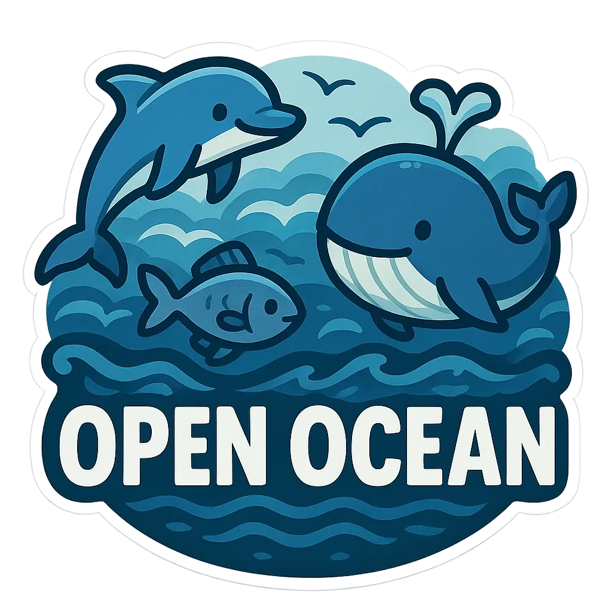

# Open Ocean Protocol

## Overview

The Open Ocean Protocol is a decentralized protocol that enables people to own their digital presence and collaborate with AI. It provides a foundation for building applications that respect user agency and data ownership.

The protocol consists of several components that work together to create a cohesive system:

1. **Identity** - Self-sovereign identity system that gives users control
1. **Memory** - Personal storage system that preserves causal history

## Core Principles

- **User ownership** - Users own their data and control access to it
- **Interoperability** - Components work together across applications
- **Privacy** - Users control what information is shared and with whom
- **Agency** - Systems act on behalf of users according to their intent

## Protocol Architecture

The Open Ocean Protocol is built on several foundational technologies:

### Identity System

The [Identity System](identity.md) provides self-sovereign identities built on public key cryptography. Users control their identity without relying on centralized authorities.

### Memory Protocol

The [Memory Protocol](memory.md) defines how data is stored, synchronized, and shared. It uses a verifiable append-only log with a consistent fact model that enables:

- Strong consistency guarantees
- User ownership and portability
- Data integrity through verifiable logs
- User-controlled data environments (Spaces)
