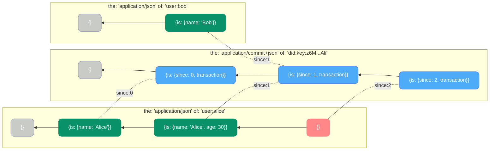
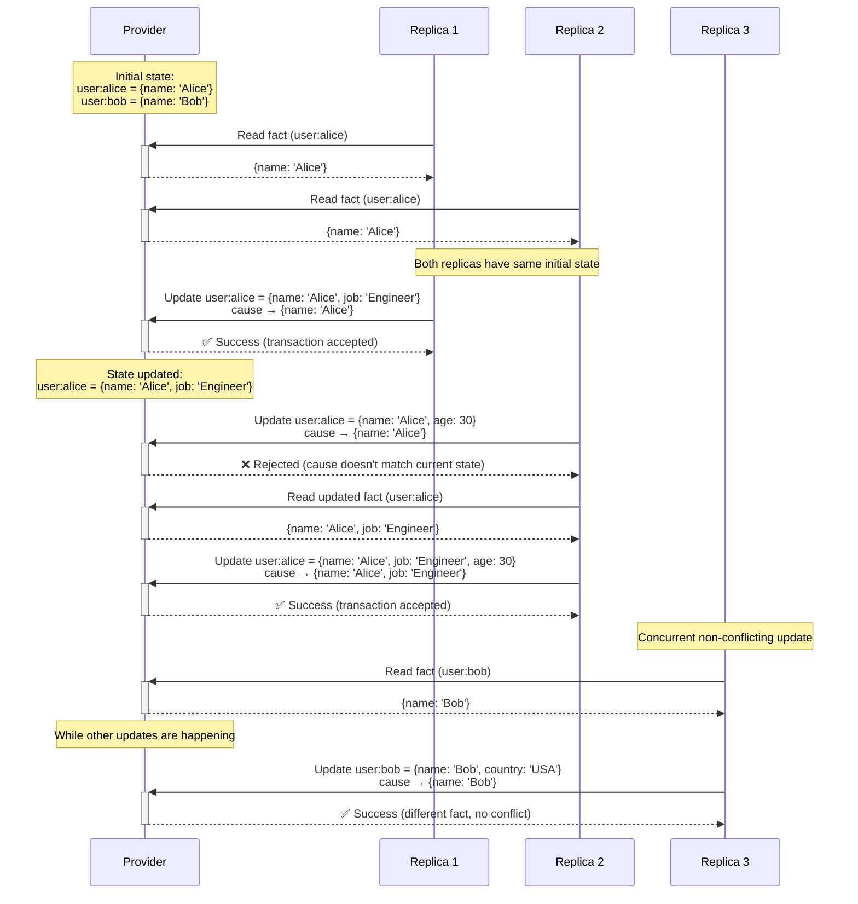
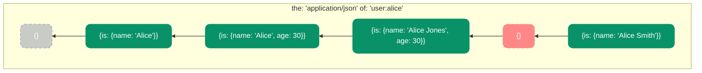

# Memory Protocol


## Editors

- [Irakli Gozalishvili], [Common Tools]

## Authors

- [Irakli Gozalishvili], [Common Tools]

## Abstract

A [space] can be defined as a namespace for personal data. It is created locally on a user device by generating a cryptographic keypair and identified globally via the [did:key] of the generated public key. This ensures the user has sole and complete authority over their space.

This document describes the **memory protocol**, designed for space providers operated similar to existing federated service providers. The protocol allows principals authorized by the space owner to store, update, and query data in a transparent and auditable way, ensuring the user remains in full control.

The protocol is desined to enable a fabric of federated providers that can replicate spaces, yet retain users control to switch providers at will without disruption or loss of their data or space identifier. This approach ensures data portability while preserving the user's authority, allowing them to migrate between providers as needed without sacrificing ownership or control of their personal data.

## Language

The key words "MUST", "MUST NOT", "REQUIRED", "SHALL", "SHALL NOT", "SHOULD", "SHOULD NOT", "RECOMMENDED", "MAY", and "OPTIONAL" in this document are to be interpreted as described in [RFC2119](https://datatracker.ietf.org/doc/html/rfc2119).

## Concepts

### Spaces: User-Controlled Data Environments

A space is a personal data environment fully controlled by its owner. Unlike traditional web applications where data is siloed within application-controlled servers, spaces provide a user-centric model:

1. **User-controlled identity** - Each space is identified by a [did:key], derived from a cryptographic keypair generated on the user's device
2. **Delegated authority** - All operations on a space must be authorized by the space owner through cryptographic signatures
3. **Portable data** - Data in a space belongs to the user and can be accessed across different applications and devices
4. **Verifiable history** - All changes to a space are recorded in a verifiable, append-only log

This model inverts the traditional power relationship, giving users true ownership of their data while allowing selective sharing with applications and services.

### Authorization Model

The Memory protocol uses the [UCAN] (User Controlled Authorization Network) model to manage access to spaces:

1. **Space as root authority** - The space's [did:key] serves as the root of authority
2. **Capability-based security** - Access is granted through explicit capabilities that define what actions are permitted
3. **Delegable permissions** - The space owner can delegate capabilities to applications, which can further delegate to other services if permitted
4. **Verifiable chain** - Each operation must present a valid chain of delegation tracing back to the space owner

Every operation in the Memory protocol must include a valid delegation chain that proves it was authorized by the space owner, either directly or transitively.

### Subject

Every [UCAN] [delegation] and consequently [invocation] defined by the Memory protocol MUST have a `subject` that is the [did:key] of the space. This subject identifies which space the capability applies to.

> ℹ️ This setup allows protocol providers to verify whether invoked capabilities have been authorized by the space owner.

### Protocol Architecture

The Memory protocol is built around an append-only transaction log that ensures consistency and maintains a complete history of all changes:

1. **Transaction log** - An immutable record of all operations applied to the space
2. **Derived state** - The current state of the space, computed by applying all transactions in sequence
3. **Causal references** - Links between facts that ensure consistency and proper sequencing
4. **Atomic transactions** - All changes are applied as complete, all-or-nothing operations

This architecture provides strong consistency guarantees while enabling flexible data modeling and scalable implementations.

## Implementation

### Transaction Log

The core of the Memory protocol is an append-only transaction log. Each entry in this log represents a complete, atomic operation that has been authorized by the space owner and validated by the protocol provider.

The transaction log creates a complete, verifiable history of all changes to the space, forming the foundation for both data consistency and provenance tracking.

#### Commits

Each transaction is recorded as a commit, which is a special fact with the following characteristics:

- `the` field is set to `application/commit+json`
- `of` field is set to the space [did:key]
- `is` field contains an object with:
  - `transaction`: the signed UCAN invocation for the operation
  - `since`: a logical clock value that increments with each transaction
- `cause` field references the previous commit in the chain, or a genesis commit for the first transaction

This commit pattern provides several important benefits:

1. **Auditability** - The complete history of all changes to the space can be audited by traversing the commit chain
2. **Provenance** - Each commit includes the signed UCAN invocation, recording who authorized the transaction
3. **Consistency** - The commit chain preserves the causal ordering of all transactions
4. **Recovery** - The complete transaction history can be used to rebuild the state of the space at any point

Commits form their own causal chain, with each commit referencing its predecessor via the `cause` field. This creates an unbroken chain from the space's creation to its current state.

#### Transaction Log Visualization

The following diagram illustrates how the commit chain tracks transactions:



In this diagram:

- Fact chains (green/red) are organized horizontally in subgraphs by resource
- Commits (blue) form a vertical chain in the Transaction Log box
- Subgraph titles include both `the` and `of` fields for clarity
- Node contents show the fact structure with explicit `is` field (empty objects `{}` for genesis nodes and retractions that have no `is` value)
- Genesis nodes (semi-transparent) establish the starting points for each chain
- Solid arrows represent causal relationships
- Dotted lines connect commits to the facts they created, labeled with the commit's logical clock value
- Notice that commit C2 creates multiple facts (F2 and F4) in a single transaction, affecting different resources

#### Causal References for Consistency

Causal references are a fundamental mechanism that enables consistency guarantees and optimistic concurrency control. Each transaction includes causal references that must point to the current state to be accepted. This ensures that:

1. Transactions are applied in a consistent order
2. Concurrent updates are detected and handled appropriately
3. The transaction log maintains a clear causal history

For initial transactions with no predecessors, the causal reference points to a genesis state, which is essentially a retraction with the `cause` field omitted. This genesis state establishes the starting point of the causal chain and provides a consistent reference point for the first mutation.

#### Concurrent Transaction Handling

The following sequence diagram illustrates how the protocol handles concurrent updates:



This sequence diagram illustrates:

- **Conflict scenario:**
  - Two replicas read the same initial state for user:alice
  - Replica 1's update succeeds because it's processed first
  - Replica 2's update is rejected because the state has changed
  - Replica 2 reads the new state and successfully updates with the correct cause

- **Non-conflict scenario:**
  - Replica 3 concurrently updates a different fact (user:bob)
  - This succeeds even while other updates are happening
  - Since it affects a different resource, there's no causal conflict

This optimistic concurrency control ensures consistency while allowing independent resources to be updated concurrently.

### Derived Fact State

Facts represent the derived state of the space, computed by applying all transactions from the log. The state of a space at any point is the collection of all active facts.

Each fact belongs to a specific resource and media type, identified by its `{the, of}` pair, which forms a lineage of revisions. Facts can be either asserted (added/updated) or retracted (deleted).

#### Fact Structure

Facts follow a structured format with several key fields:

```ts
type Fact<The extends MIME, Of extends URI, Is extends JSONValue> =
  | Assertion<The, Of, Is>
  | Retraction<The, Of, Is>

type Assertion<The extends MIME, Of extends URI, Is extends JSONValue> = {
  the: The
  of: Of
  is: Is
  cause: Reference<Assertion<The, Of, Is> | Retraction<The, Of, Is>>
}

type Retraction<The extends MIME, Of extends URI, Is extends JSONValue> = {
  the: The
  of: Of
  is?: undefined
  cause?: Reference<Assertion<The, Of, Is>>
}

type URI = `${string}:${string}`
type MIME = `${string}/${string}`
```

#### Fact Fields

##### `of` - Resource Identifier

The `of` field identifies which resource this fact describes. It MUST be a URI that uniquely identifies the resource. This allows facts to be organized and queried by resource identity.

##### `the` - Media Type

The `the` field specifies the [media type] of the fact, defining the semantic meaning and expected structure of the data. Multiple semantically distinct states can be associated with the same resource through different media types:

- `application/json` for structured data
- `application/commit+json` for transaction records

##### `is` - State Data

The `is` field contains the actual state data for an assertion. Its structure and meaning are determined by the `the` field (media type). For retractions, this field MUST be omitted.

##### `cause` - Causal Reference

The `cause` field contains a [merkle-reference] to the previous fact in this lineage. It creates a causal chain that ensures consistency and tracks the complete revision history.

For initial assertions, the `cause` references a genesis fact that establishes the starting point of the causal chain. This genesis fact is essentially a retraction with matching `the` and `of` values but with the `cause` field omitted, representing the initial absence of the fact.

#### Fact Causal Chain Visualization

The following diagram illustrates how causal chains work for facts with the same `{the, of}` pair:



In this diagram:

- The subgraph title shows both `the` and `of` fields for the facts
- Node contents show the fact structure with explicit `is` field (empty objects `{}` for genesis nodes and retractions that have no `is` value)
- Arrows point from newer facts to older ones (showing causal references)
- Assertions (green) add or update state, while retractions (red with empty `{}` content) delete it
- The genesis fact (semi-transparent with empty `{}` content) establishes the starting point
- The chain shows a complete revision history in a logical grouping
- The sequence includes deletion (retraction) and later recreation of the fact

#### Fact Types

##### Assertion

An assertion adds or updates a fact in the space:

- The `is` field MUST contain the state data according to the specified media type
- The `cause` field MUST reference the previous fact in this lineage
- Initial assertions reference a genesis fact _(retraction with the same `{the, of}` values and no `cause` field)_

##### Retraction

A retraction logically deletes a fact:

- The `is` field MUST be omitted
- The `cause` field MUST reference the most recent assertion in this lineage
- Retractions extend the causal chain rather than breaking it

### Media Type Support

Valid implementation MUST support `application/json`. More media types may be added in the future. The `application/commit+json` media type is reserved and transactions containing changes with it SHOULD be rejected.

## Capabilities

The Memory protocol defines a set of capabilities that allow interaction with a space. Each capability is implemented as a [UCAN] with a specific command and arguments structure.

### `/memory/transact`

The transact capability allows asserting or retracting facts in a space.

#### Purpose

This capability is used to:

- Add new data to a space
- Update existing data in a space
- Remove data from a space

#### Authorization Requirements

Every invocation MUST include a valid UCAN chain that:

- Has the space's [did:key] as the subject
- Has a valid delegation chain rooted in the space [did:key]

#### Request Format

```ts
type Transaction = {
  changes: Changes
}

type Changes = {
  [of: URI]: {
    [the: MIME]: {
      [cause: string]: Assert | Retract | Claim;
    };
  };
}

type Assert = { is: JSONValue }
type Retract = { is?: undefined }
type Claim = true
```

The `changes` field defines modifications to make, organized by resource (`of`) and media type (`the`). Each change includes a causal reference to ensure consistency.

- **Assert**: Adds or updates a fact with the specified state data in the `is` field
- **Retract**: Deletes a fact by omitting the `is` field
- **Claim**: Validates that the fact's current state matches the specified cause without modifying it

The Claim variant is particularly useful for ensuring consistency guarantees in a Software Transactional Memory (STM) style. It allows transactions to list all facts they read to produce an update, ensuring none have changed since they were read, without actually modifying those facts.

#### Processing

When a transaction is submitted:

1. The provider verifies the authorization chain back to the space DID
2. The provider verifies all causal references to ensure consistency
3. If verification succeeds, the transaction is recorded as a commit in the transaction log
4. The derived fact state is updated to reflect ALL changes specified in the transaction:
   - Each Assert creates or updates a fact
   - Each Retract removes a fact
   - Each Claim verifies a fact's current state without modifying it
5. A response is provided indicating success or failure

The provider MUST process transactions atomically, following [compare and swap (CAS)][CAS] semantics. All changes in a transaction succeed or fail together, based on whether their causal references are current. This ensures that the transaction represents a consistent view of the space at a specific point in time.

#### Example

```json
{
  "iss": "did:key:z6MkhaXgBZDvotDkL5257faiztiGiC2QtKLGpbnnEGta2doK",
  "sub": "did:key:z6MkffDZCkCTWreg8868fG1FGFogcJj5X6PY93pPcWDn9bob",
  "cmd": "/memory/transact",
  "args": {
    "changes": {
      "uuid:5d59a2ff-5aa7-419d-8b3a-547063a2fd23": {
        "application/json": {
          "ba4jca7rv4dlr5n5uuvcz7iht5omeukavhzbbpmc5w4hcp6dl4y5sfkp5": {
            "is": { "hello": "world" }
          }
        }
      }
    }
  },
  "nonce": {"/": {"bytes": "TWFueSBopvcs"}},
  "meta": {},
  "exp": 1697409438,
  "prf": [
    {"/": "zdpuAzx4sBrBCabrZZqXgvK3NDzh7Mf5mKbG11aBkkMCdLtCp"}
  ]
}
```

### `/memory/query`

The query capability allows retrieving the state of facts in a space, either the current state or at a specific logical time point.

#### Purpose

This capability is used to:

- Read the state of facts in a space (current or at a specific logical time)
- Filter facts by resource, media type, or other criteria
- Retrieve a consistent snapshot of the space at a point in time

#### Request Format

```ts
type Query = {
  select: Selector
  since?: number
}

type Selector {
  [of: URI]: {
    [the: string]: {
      [cause: string]: {
        is?: {}
      }
    }
  }
}
```

The `select` field defines which facts to retrieve, based on resource (`of`), media type (`the`), and optionally causal reference.

The `since` field can limit results to facts derived from transactions after a specific logical time point in the transaction log, allowing retrieval of state at different points in time.

#### Transactional Guarantees

All results from a query MUST represent a consistent snapshot at a specific transaction point. Results MUST NOT include partial updates or facts from different logical time points.

#### Examples

Query for a specific resource:

```ts
{
  "iss": "did:key:z6MkhaXgBZDvotDkL5257faiztiGiC2QtKLGpbnnEGta2doK",
  "sub": "did:key:z6MkffDZCkCTWreg8868fG1FGFogcJj5X6PY93pPcWDn9bob",
  "cmd": "/memory/query",
  "args": {
    "select": {
      "uuid:5d59a2ff-5aa7-419d-8b3a-547063a2fd23": {
        "application/json": {
        }
      }
    }
  },
  "nonce": {"/": {"bytes": "TWFueSBopvcs"}},
  "meta": {},
  "exp": 1697409438,
  "prf": [
    {"/": "zdpuAzx4sBrBCabrZZqXgvK3NDzh7Mf5mKbG11aBkkMCdLtCp"}
  ]
}
```

Query for all commits:

```ts
{
  "iss": "did:key:z6MkhaXgBZDvotDkL5257faiztiGiC2QtKLGpbnnEGta2doK",
  "sub": "did:key:z6MkffDZCkCTWreg8868fG1FGFogcJj5X6PY93pPcWDn9bob",
  "cmd": "/memory/query",
  "args": {
    "select": {
      "_": {
        "application/commit+json": {
        }
      }
    }
  },
  "nonce": {"/": {"bytes": "TWFueSBopvcs"}},
  "meta": {},
  "exp": 1697409438,
  "prf": [
    {"/": "zdpuAzx4sBrBCabrZZqXgvK3NDzh7Mf5mKbG11aBkkMCdLtCp"}
  ]
}
```

### `/memory/subscribe` {#memorysubscribe}

The subscribe capability allows receiving real-time updates when changes occur in a space, functioning as a push-based complement to the poll-based `/memory/query` capability.

#### Purpose

This capability is used to:

- Receive notifications when new transactions are committed
- Maintain an up-to-date view of a space without polling
- Build reactive applications that respond to changes
- Enable push-based replication of facts matching specific criteria

#### Request Format

```ts
type Subscription = {
  select: Selector
  since?: number
}
```

The subscription request format mirrors the query format, using the same `Selector` structure to specify which facts to monitor. When facts matching the selector are added or modified, subscribers receive notifications with the updated facts.

The `since` parameter functions similarly to query, allowing subscriptions to begin from a specific logical time point in the transaction log.

#### Push vs Poll Architecture

While `/memory/query` implements a traditional poll-based approach requiring clients to repeatedly request state, `/memory/subscribe` establishes a persistent connection that pushes updates to clients when changes occur. This:

- Reduces network overhead by eliminating unnecessary polling
- Decreases latency between state changes and client notifications
- Enables efficient real-time replication across distributed systems
- Supports building reactive user interfaces that reflect state changes immediately

[Common Tools]: https://common.tools/
[Irakli Gozalishvili]: https://github.com/gozala
[did:key]:https://w3c-ccg.github.io/did-key-spec/
[UCAN]:https://github.com/ucan-wg/spec
[capability]:https://github.com/ucan-wg/spec?tab=readme-ov-file#capability
[capabilities]:https://github.com/ucan-wg/spec?tab=readme-ov-file#capability
[delegation]:https://github.com/ucan-wg/delegation
[invocation]:https://github.com/ucan-wg/invocation
[JSON]:https://www.json.org/json-en.html
[media type]:https://www.iana.org/assignments/media-types/media-types.xhtml
[subject]:#subject
[command]:https://github.com/ucan-wg/spec?tab=readme-ov-file#command
[CAS]:https://en.wikipedia.org/wiki/Compare-and-swap
[merkle-reference]:https://github.com/Gozala/merkle-reference/blob/main/docs/spec.md
[`/memory/transact`]:#memorytransact
[space]:#Spaces_User-Controlled_Data_Environments
[commit]:#commits
[fact]:#Derived_Fact_State
