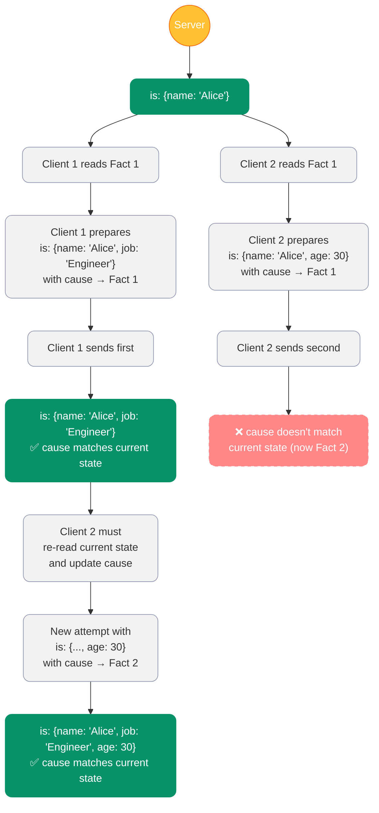
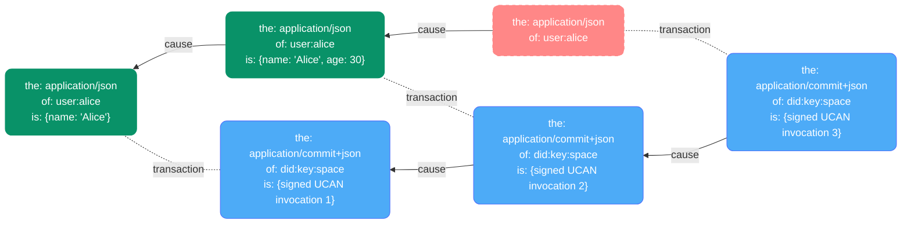

# Space


## Editors

- [Irakli Gozalishvili], [Common Tools]

## Authors

- [Irakli Gozalishvili], [Common Tools]

## Abstract

A space can be defined as a namespace for a personal data. It is created locally on a user device by generating cryptographic keypair and identified globally via [did:key] of the generated public key. This document describes "memory" protocol which can be used to store data in space and retrieved from space.

- [Capabilities](#capabilities)
  - [`/memory/transact`](#memoryttransact)
  - [`/memory/query`](#memoryquery)
  - [`/memory/subscribe`](#memorysubscribe)

## Language

The key words "MUST", "MUST NOT", "REQUIRED", "SHALL", "SHALL NOT", "SHOULD", "SHOULD NOT", "RECOMMENDED", "MAY", and "OPTIONAL" in this document are to be interpreted as described in [RFC2119](https://datatracker.ietf.org/doc/html/rfc2119).

## Protocol

The protocol is defined in terms of [UCAN] [capabilities](capability) that can be delegated by the space [did:key] to and delegate [did:key] giving them authorization to invoke it on their behalf.

### Subject

Every [UCAN] [delegation] and consequently [invocation] defined by the "memory" protocol MUST have a `subject` that is a [did:key] of the space.

> ℹ️ This setup allows protocol provider to verify whether invoked capability has being authorized by the space owner.

### Fact

Facts represent a certain memory stored in the space. A fact can be either asserted (when adding or updating) or retracted (when deleting). Facts follow a structured format with several key fields that define their meaning and relationship to other facts.

```ts
type Fact<The extends MIME, Of extends URI, Is extends JSONValue> =
  | Assertion<T, Of, Is>
  | Retraction<T, Of, Is>

type Assertion<The extends MIME, Of extends URI, Is extends JSONValue> = {
  the: The
  of: Of
  is: Is
  cause: Reference<Assertion<The, Of, Is> | Retraction<The, Of, Is>>
}

type Retraction<The extends MIME, Of extends URI, Is extends JSONValue> = {
  the: The
  of: Of
  is?: undefined
  cause?: Reference<Assertion<The, Of, Is>>
}

type URI = `${string}:${string}`
type MIME = `${string}/${string}`
```

#### Fact Fields

##### `of` - Resource Identifier

The `of` field identifies the resource that this fact is about. It MUST be a URI that uniquely identifies the target resource. This allows facts to be organized and queried by resource identity.

##### `the` - Media Type

The `the` field specifies the [media type] of the fact. This defines the semantic meaning and expected structure of the data in the `is` field. Multiple semantically distinct states can be associated with the same resource through different media types.

For example, the same resource might have facts with different media types:
- `application/json` for structured data
- `text/plain` for human-readable description
- `application/commit+json` for version control information

##### `is` - State Data

The `is` field contains the actual state data for the fact. Its structure and meaning are determined by the `the` field (media type). For assertions, this field contains the state data. For retractions, this field MUST be omitted, appearing as `undefined` in JS.

##### `cause` - Causal Reference

The `cause` field contains a [merkle-reference] to the fact that this fact is causally related to. This reference MUST point to the previous fact with the same `the` and `of` values, forming a revision chain at the fact granularity. Each revision chain tracks the complete history of a specific fact identified by its `{the, of}` pair.

This causal chain enables several critical features:
1. **Revision history** - The complete history of changes to any fact can be traced through its causal chain
2. **Conflict detection** - Changes based on outdated causes can be detected and rejected
3. **Consistency guarantees** - The causal relationships between facts form the foundation for enforcing transactional semantics and maintaining data consistency

The chain of causal references is the fundamental mechanism that enables [compare-and-swap (CAS)][CAS] semantics in the protocol, which in turn provides strong consistency guarantees. For initial assertions (with no previous facts), the `cause` MUST be a [merkle-reference] to a basic `{ the, of }` pair (with the same values as the assertion itself), which represents a virtual retraction with the optional `cause` field left out. This establishes the starting point of the causal chain and provides a consistent reference point for the first mutation.

###### Causal Chain Visualization

The following diagram illustrates how causal chains work for facts with the same `{the, of}` pair:

```mermaid
graph RL
    classDef assertion fill:#099268,stroke:#099268,stroke-width:1px,color:#fff,rx:10,ry:10;
    classDef retraction fill:#FF8787,stroke:#FF8787,stroke-width:1px,color:#fff,stroke-dasharray:5 5,rx:10,ry:10;
    classDef virtual fill:#9398B080,stroke:#9398B0,stroke-width:1px,color:#fff,stroke-dasharray:5 5,rx:10,ry:10;

    VR["the: application/json<br>of: user:alice<br>"]:::virtual
    A["the: application/json<br>of: user:alice<br>is: {name: 'Alice'}"]:::assertion -->|cause| VR
    B["the: application/json<br>of: user:alice<br>is: {name: 'Alice', age: 30}"]:::assertion -->|cause| A
    C["the: application/json<br>of: user:alice<br>is: {name: 'Alice Jones', age: 30}"]:::assertion -->|cause| B
    D["the: application/json<br>of: user:alice"]:::retraction -->|cause| C
    E["the: application/json<br>of: user:alice<br>is: {name: 'Alice Smith'}"]:::assertion -->|cause| D
```



In this diagram:
- Each node is a fact with the same `{the, of}` values (`application/json` and `user:alice`)
- Facts flow from right to left chronologically (newer facts on the left)
- Assertions are shown in green and retractions in red with dashed borders
- The virtual retraction is semi-transparent with dashed borders to indicate it's not a real fact
- Arrows show the `cause` relationships, pointing from each fact to its predecessor
- Each newer fact references an older fact in its `cause` field
- The first assertion references a "Virtual Retraction" with the same `the` and `of` values
- The diagram shows how a fact can be deleted (with a retraction) and later re-created
- The consistency of this chain is enforced by the transactional semantics of the protocol
- Any attempt to create a fact with an outdated or incorrect cause reference would be rejected

###### Concurrent Update Handling

The following diagram illustrates how the protocol handles concurrent updates to maintain consistency:



In this diagram:
- Assertions are shown in green and rejections in red with dashed borders
- The server is highlighted in orange
- Both clients read the same initial state (Fact 1)
- Client 1 successfully updates the fact because its cause reference is still current
- Client 2's update is rejected because the state has changed (Fact 1 → Fact 2)
- Client 2 must re-read the current state, update its cause reference, and try again
- This optimistic concurrency control prevents lost updates and ensures consistency

#### Fact Types

##### Assertion

An assertion represents the addition or update of a fact in the space. When asserting a fact:
- The `is` field MUST contain the state data according to the media type specified in `the`.
- The `cause` field MUST reference the previous fact for this `{the, of}` pair, if one exists. This forms a causal chain that enables the system to track the complete revision history of the fact and enforce consistency guarantees.
- Initial assertions (with no previous facts) MUST include a `cause` that is a [merkle-reference] to a basic `{ the, of }` pair (matching the assertion's own `the` and `of` values), which represents a virtual retraction with the optional `cause` field left out. This establishes the starting point of the causal chain and ensures every fact has a valid predecessor.

##### Retraction

A retraction represents the deletion of a fact from the space. When retracting a fact:
- The `is` field MUST be undefined.
- The `cause` field MUST reference the most recent assertion for this `{the, of}` pair. This maintains the causal chain and ensures that only the most up-to-date version of a fact can be retracted.

Retractions are used to logically delete facts while maintaining causal history. They do not break the causal chain but rather extend it, allowing the system to track when and why facts were removed.

### Commit

A commit represents a record of a complete transaction applied to the space. Each transaction creates a successor fact with the following characteristics:
- `the` field is set to `application/commit+json`
- `of` field is set to the space [did:key]
- `is` field contains the signed UCAN invocation for the `/memory/transact` operation

This commit pattern creates a complete, append-only transaction history for the space, where each transaction is permanently recorded with its full details. The commit chain provides several important benefits:

1. **Auditability** - The complete history of all changes to the space can be audited by traversing the commit chain
2. **Provenance** - Each commit includes the signed UCAN invocation, which records who authorized the transaction and what capabilities were delegated
3. **Consistency** - The commit chain preserves the causal ordering of all transactions, ensuring a clear timeline of changes
4. **Recovery** - The commit history can be used to rebuild the state of the space at any point in time

Commits follow the same causal chain pattern as regular facts, with each commit referencing its predecessor via the `cause` field. This creates an unbroken chain of all transactions ever applied to the space, providing a complete audit trail from the space's creation to its current state.

#### Commit Chain Visualization

The following diagram illustrates how the commit chain tracks transactions:



In this diagram:
- Blue nodes are commits, each containing a signed UCAN invocation
- Green nodes are fact assertions
- Red nodes are fact retractions
- Solid arrows show causal relationships between facts of the same type
- Dotted lines show which transactions created which facts
- Each commit forms part of an unbroken chain of all transactions
- Regular facts maintain their own separate causal chains

The commit mechanism enhances the space protocol with strong provenance guarantees, allowing systems to track not just what changed, but who authorized each change and when it occurred.

### Media Type Support

Valid implementation MUST support `application/json` media type. More media types may be added in the future.

### Capabilities

Protocol is defined in terms of following [UCAN] capabilities.

#### `/memory/transact`

Capability MAY be used to assert or retract set of [fact]s in a [subject] (memory) space. Capability [command] MUST be set to `/memory/transact`. Invoked capability MUST have `args` object conforming to a following schema

```ts
type Transaction = {
  changes: Changes
}

type Changes = {
  [of: URI]: {
    [the: MIME]: {
      [cause: string]: Assert | Retract | Claim;
    };
  };
}

type Assert = { is: JSONValue }
type Retract = { is?: undefined }
type Claim = true
```

Valid capability provider MUST update state transactionally adhering to [compare and swap (CAS)][CAS] semantics, in order to uphold consistency guarantees. That implies that all assertions and retractions MUST be applied atomically and only if the `cause` of every supplied `{the, of}` pair corresponds to the [merkle-reference] of the current (most recent) [Fact] for that pair. This verification ensures that no concurrent updates have occurred since the client last read the data. Any transaction where this invariant does not hold MUST be rejected in full, meaning none of the enclosed assertions or retractions can be applied. This all-or-nothing approach, combined with causal references, provides strong consistency guarantees and prevents data corruption from concurrent modifications.

The `cause` of a new fact MUST be a [merkle-reference] to the previous [Fact] with the same `{the, of}` pair, with all optional fields omitted in the reference. This maintains the causal chain and ensures the proper sequencing of updates.

#### Example

```json
{
  "iss": "did:key:z6MkhaXgBZDvotDkL5257faiztiGiC2QtKLGpbnnEGta2doK",
  "sub": "did:key:z6MkffDZCkCTWreg8868fG1FGFogcJj5X6PY93pPcWDn9bob",
  "cmd": "/memory/transact",
  "args": {
    "changes": {
      "uuid:5d59a2ff-5aa7-419d-8b3a-547063a2fd23": {
        "application/json": {
          "ba4jca7rv4dlr5n5uuvcz7iht5omeukavhzbbpmc5w4hcp6dl4y5sfkp5": {
            "is": { "hello": "world" }
          }
        }
      }
    }
  },
  "nonce": {"/": {"bytes": "TWFueSBopvcs"}},
  "meta": {},
  "exp": 1697409438,
  "prf": [
    {"/": "zdpuAzx4sBrBCabrZZqXgvK3NDzh7Mf5mKbG11aBkkMCdLtCp"}
  ]
}
```

#### `/memory/query`

Capability MAY be used to query space in order to retrieve desired facts from the [subject] (memory) space. Capability command MUST be set to `/memory/query`. Inovked capability MUST have `args` object conforming to a following schema

```ts
type Query = {
  select: Selector
  since?: number
}

type Selector {
  [of: URI]: {
    [the: string]: {
      [cause: string]: {
        is?: {}
      }
    }
  }
}
```

The `since` field MAY be specified to limit query to select only facts that have being asserted after that number of transactions. It defaults to `0` if omitted.

The `of`, `the` and `cause` of the `select` CAN be set to select facts that match those values. Each of these components CAN be `"_"` value to match any value.

#### Transactional Guarantees

Valid capability provider MUST ensure that all results from a query are returned from the same logical time. This means that the complete result set MUST represent a consistent snapshot of the space's state at a specific transaction commit point. Results MUST NOT include partial updates from in-progress transactions or combine facts from different logical time points, as this would violate the consistency guarantees and could lead to an inconsistent view of the data.

#### Example

Selects fact for the `uuid:5d59a2ff-5aa7-419d-8b3a-547063a2fd23` corresponding to the `application/json` media type.

```ts
{
  "iss": "did:key:z6MkhaXgBZDvotDkL5257faiztiGiC2QtKLGpbnnEGta2doK",
  "sub": "did:key:z6MkffDZCkCTWreg8868fG1FGFogcJj5X6PY93pPcWDn9bob",
  "cmd": "/memory/transact",
  "args": {
    "select": {
      "uuid:5d59a2ff-5aa7-419d-8b3a-547063a2fd23": {
        "application/json": {
        }
      }
    }
  },
  "nonce": {"/": {"bytes": "TWFueSBopvcs"}},
  "meta": {},
  "exp": 1697409438,
  "prf": [
    {"/": "zdpuAzx4sBrBCabrZZqXgvK3NDzh7Mf5mKbG11aBkkMCdLtCp"}
  ]
}
```

Selects all facts that have state associated with `application/commit+json` media type.

```ts
{
  "iss": "did:key:z6MkhaXgBZDvotDkL5257faiztiGiC2QtKLGpbnnEGta2doK",
  "sub": "did:key:z6MkffDZCkCTWreg8868fG1FGFogcJj5X6PY93pPcWDn9bob",
  "cmd": "/memory/transact",
  "args": {
    "select": {
      "_": {
        "application/commit+json": {
        }
      }
    }
  },
  "nonce": {"/": {"bytes": "TWFueSBopvcs"}},
  "meta": {},
  "exp": 1697409438,
  "prf": [
    {"/": "zdpuAzx4sBrBCabrZZqXgvK3NDzh7Mf5mKbG11aBkkMCdLtCp"}
  ]
}
```

#### `/memory/subscribe`

[Common Tools]: https://common.tools/
[Irakli Gozalishvili]: https://github.com/gozala
[did:key]:https://w3c-ccg.github.io/did-key-spec/
[UCAN]:https://github.com/ucan-wg/spec
[capability]:https://github.com/ucan-wg/spec?tab=readme-ov-file#capability
[delegation]:https://github.com/ucan-wg/delegation
[invocation]:https://github.com/ucan-wg/invocation
[JSON]:https://www.json.org/json-en.html
[media type]:https://www.iana.org/assignments/media-types/media-types.xhtml
[subject]:#subject
[fact]:#fact
[command]:https://github.com/ucan-wg/spec?tab=readme-ov-file#command
[CAS]:https://en.wikipedia.org/wiki/Compare-and-swap
[merkle-reference]:https://github.com/Gozala/merkle-reference/blob/main/docs/spec.md
